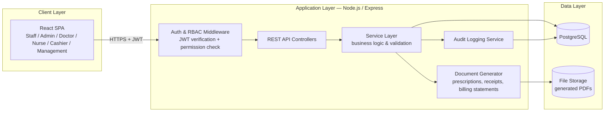
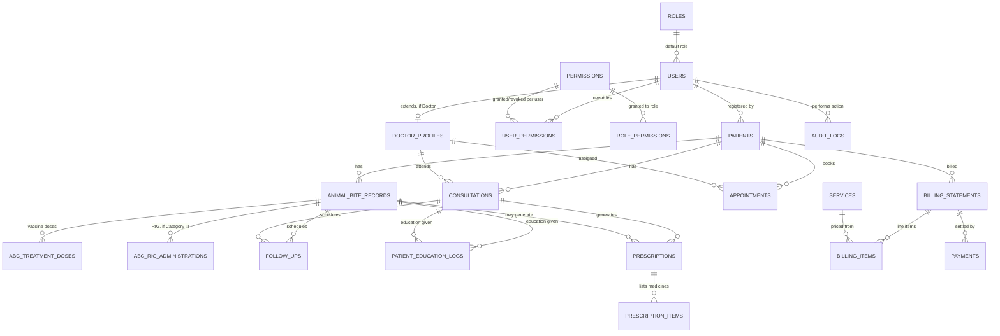
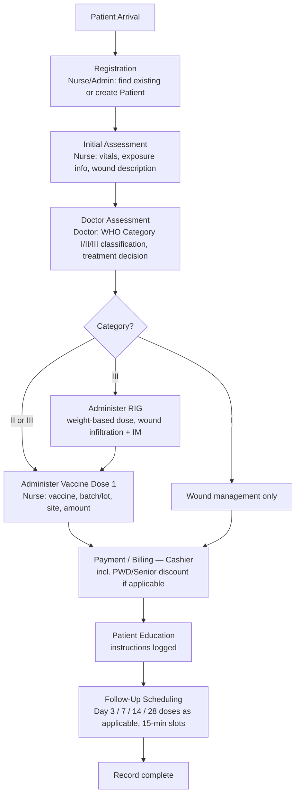
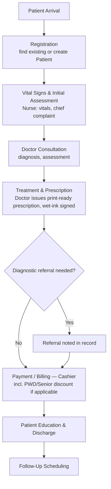
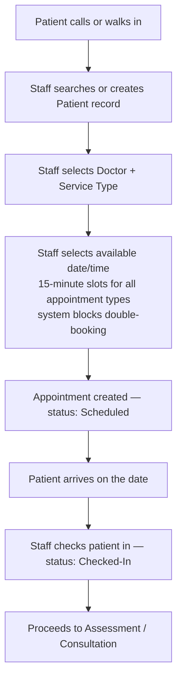
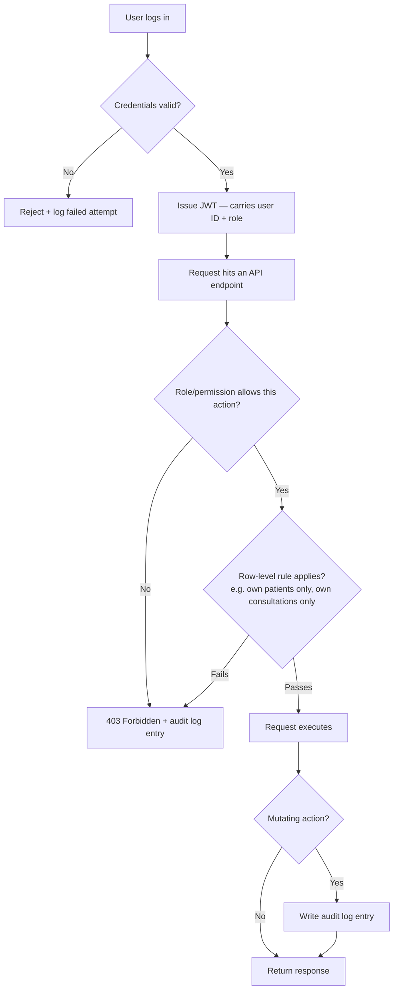

# Clover Clinic Management System — Architecture & Database Design

**Phase 1 scope:** Authentication & RBAC · Patient Registration & Records · Animal Bite Center · Medical Consultation · Basic Appointments · Basic Billing
**Status:** Confirmed for Phase 1 development — architecture, schema, RBAC, and the open items below have been reviewed and decided. Auth & RBAC foundation is next.

This document is organized so it can keep growing alongside the project: as each phase is confirmed, its detailed schema and workflows get added here rather than in a separate file.

---

## 0. Decisions on record

| Decision | Choice |
|---|---|
| Backend | Node.js + Express (REST API) |
| Frontend | React (SPA) |
| Database | PostgreSQL |
| Source control | GitHub (single repo) |
| Deployment | Cloud-hosted web app |
| Sales Journal / Ledger | Non-VAT (Percentage Tax) service business — standard BIR Manual Books of Accounts columnar format, pending your accountant/bookkeeper's sign-off before go-live |
| Clinic location | 481 Quirino Highway cor. JP Samoy Street, Novaliches, Quezon City, Philippines — single location, no second branch planned. Staff/doctor scheduling and inventory are modeled for one site. |
| Clinic contact channels & Phase 2 reminder delivery | +63 955 437 4779 (Globe) · cloverfamilycareabc@gmail.com — SMS reminders via Globe's business messaging/API, email via Gmail. API credentials/sender-ID registration happen when Phase 2 starts; provider choice is confirmed now. |
| Rabies exposure classification | WHO Category I/II/III |
| Patient ID format | `MMYY-NNNN` (e.g. `0826-0001` for the 1st patient registered in August 2026), sequence resets to `0001` each new month |
| Doctor signature on prescriptions | Wet-ink (printed name + PRC license + PTR number, physically signed after printing) — no e-signature capture in Phase 1 |
| Payment void authorization | Management and Admin, both by default |
| PWD / Senior Citizen discount | In scope for Phase 1 billing |
| Rabies immunoglobulin (RIG) | Tracked in Phase 1 alongside vaccine doses, not deferred |

Everything else below is my proposal, not something you've already agreed to — flag anything that doesn't match how the clinic actually needs to work.

---

## 1. System Architecture

### 1.1 High-level architecture



**Why this shape:**

- A single React SPA serves every staff-side role (Management/Admin/Doctor/Nurse/Cashier) — the UI shows/hides modules per role, but the **real enforcement happens server-side** in the RBAC middleware and service layer. The client never decides what a user is allowed to do; it only reflects what the server already permitted.
- The **Audit Logging Service** sits in the service layer, not bolted on at the database level, so it can capture *who did what and why* (e.g., "voided payment #123, reason: patient overcharged"), not just raw row changes.
- The **Patient Portal** (Phase 4) is deliberately a separate frontend app talking to the same API, not bolted onto the staff SPA — different audience, different auth flow (patient self-registration/login), different security posture (public-facing).

*(File storage no longer needs to hold signature images, since prescriptions are wet-ink signed after printing — it still holds generated PDFs.)*

### 1.2 Repository structure (GitHub, single repo)

```
clover-clinic-system/
├── backend/              # Node.js + Express API
│   ├── src/
│   │   ├── modules/      # one folder per module: auth, patients, animal-bite, consultations, appointments, billing, audit...
│   │   ├── middleware/   # auth, rbac, audit, error handling
│   │   ├── db/           # migrations, seeders, models
│   │   └── services/     # PDF generation, notifications (later phase)
│   └── tests/
├── frontend/             # React SPA (staff/admin)
│   └── src/
├── docs/                 # this document + phase-by-phase specs live here
└── .github/workflows/    # CI: lint, test, build on every push/PR
```

Backend and frontend as two apps in one repo (not a single merged app) keeps the API reusable by the future patient portal and any mobile client, without duplicating business logic.

### 1.3 Hosting proposal (cloud-hosted, as confirmed)

| Component | Recommendation |
|---|---|
| Frontend | Static build deployed to a CDN-backed host (e.g. Vercel/Netlify) or served via Nginx alongside the API |
| Backend API | Containerized (Docker), deployed to a small managed host (e.g. Render/Railway) or a single VPS with Docker Compose — VPS is cheaper long-term for a single-location clinic |
| Database | Managed PostgreSQL with **automated daily backups** (non-negotiable given this is medical/financial data) |
| File storage | Object storage (e.g. S3-compatible) for generated PDFs, rather than the app server's local disk |
| Environments | `staging` and `production` — never test against live patient data |

This is a starting recommendation, not a committed vendor — actual choice can follow your budget once we're closer to deployment.

### 1.4 Security baseline (applies from Phase 1, not deferred to "Enhancements")

Although the phase plan places Audit Logs in Phase 4, a *minimal* audit trail and these baseline protections are built in from Phase 1, because retrofitting them onto live patient/financial data later is much riskier than building them in from day one:

- Passwords hashed with bcrypt/argon2 — never stored or logged in plaintext.
- All traffic over HTTPS.
- JWT access tokens, short-lived, with refresh tokens; tokens carry role + user ID only (no PII).
- Every mutating action (create/update/delete/void) on patient, clinical, or financial records writes an audit log entry — this is the minimal trail; richer audit *reporting/search UI* is a Phase 4 feature, but the *data* is captured from day one.
- Rate limiting + failed-login lockout on the auth endpoint.
- This system handles **sensitive personal information** under the Philippine Data Privacy Act (medical records are explicitly "sensitive personal information" under RA 10173).

---

## 2. Module Structure — reconciled with your phase plan

Your document listed modules A–J and a separate Phase 1–4 MVP roadmap. Merged into one table so there's a single source of truth going forward.

| Module | Phase | Notes |
|---|---|---|
| Auth & User Roles | **1** | Foundation for everything else |
| Patient Management (registration, profile, search, history) | **1** | Shared by Animal Bite Center and Medical Consultation |
| Animal Bite Center (assessment, treatment, vaccination + RIG logging, education, follow-up) | **1** | Vaccine/RIG batch fields are free-text in Phase 1 (no inventory yet); become FK to Inventory in Phase 2 |
| Medical Consultation (assessment, diagnosis, prescription, treatment, education, follow-up) | **1** | Prescription is print-ready, wet-ink signed |
| Appointments (internal, staff-created only) | **1** | Patient self-booking is Phase 4; Phase 1 covers doctor availability + staff-created bookings + conflict prevention |
| Billing (charges, statement, payment, receipt, PWD/Senior discount) | **1** | Confirmed in scope — see §0 |
| Inventory (stock, batches, expiration, reorder alerts) | 2 | |
| Follow-up automation, reminders (SMS/email) | 2 | Delivery via Globe (SMS) and Gmail (email), confirmed (§0) — account/API setup happens when Phase 2 starts |
| Staff Scheduling & Attendance | 2 | |
| Financial Management (sales/expense/profit, Sales Journal, Sales Ledger) | 3 | Management-only; see RBAC §3 |
| Daily Activity Reports | 3 | |
| Patient Portal (self-registration, login, booking) | 4 | |
| Full Audit Log UI (search/filter/export) | 4 | Underlying audit *data* captured from Phase 1, per §1.4 |
| Advanced reports, data export/backup | 4 | |

---

## 3. Roles & Permissions (RBAC)

### 3.1 Design approach

Two layers, not one hardcoded role check scattered through the code:

1. **Role defaults** — each role (Management, Admin, Doctor, Nurse/Clinic Staff, Cashier, Patient) has a default set of permissions.
2. **Per-user overrides** — Management can grant or revoke a specific permission for a specific user, on top of their role default.

This directly supports your own spec's language: *"accessible only to Management and **authorized Admin personnel**"* — that's a role default of "no access" for Admin, with a per-user override Management can flip on for a specific trusted Admin, fully audit-logged. Without this layer, "authorized Admin" has nowhere to live except a special case in code.

```
permissions          — the full list of fine-grained actions (e.g. payment.void, financial.view, inventory.adjust)
role_permissions     — default grants per role
user_permissions     — per-user override (grant or explicitly revoke), with who granted it and when
```

### 3.2 Permission matrix — Phase 1 modules

✅ Full access · 👁 View only · 🔒 Own records only · ➕ Create/enter · — No access

| Capability | Management | Admin | Doctor | Nurse/Staff | Cashier | Patient (Ph.4) |
|---|:---:|:---:|:---:|:---:|:---:|:---:|
| Manage user accounts (create/deactivate staff logins) | ✅ | — | — | — | — | — |
| Register new patient / edit demographics | ✅ | ➕ | — | ➕ | — | 🔒 own profile |
| Search / view patient list | ✅ | ✅ | ✅ | ✅ | 👁 (billing-relevant only) | — |
| View full patient medical history | ✅ | 👁 | ✅ | ✅ | — | 🔒 own only |
| Enter Animal Bite / Consultation initial assessment & vitals | ✅ | — | ✅ | ➕ | — | — |
| Record doctor's assessment, diagnosis, exposure classification, treatment decision | ✅ | — | ✅ own patients | — | — | — |
| Modify another doctor's diagnosis or prescription | — | — | — | — | — | — |
| Record vaccine/RIG/treatment administration | ✅ | — | ✅ | ➕ | — | — |
| Issue / print prescription (wet-ink signed) | ✅ | — | ✅ own patients | — | — | 👁 own (Ph.4) |
| Record patient education given | ✅ | — | ➕ | ➕ | — | — |
| Create / view appointments (internal) | ✅ | ✅ | 👁 own schedule | 👁 | 👁 | 🔒 own (Ph.4) |
| Create billing statement / charges (incl. PWD/Senior discount) | ✅ | ✅ | — | — | ➕ | — |
| Process payment, issue receipt | ✅ | ✅ | — | — | ✅ | — |
| **Void / reverse a payment** | ✅ | ✅ | — | — | — | — |
| View **profit / expense / financial reports** | ✅ | — (unless individually authorized) | — | — | — | — |
| View own billing history | ✅ | ✅ | — | — | ✅ | 🔒 own (Ph.4) |
| View audit log entries | ✅ | 👁 own actions only | — | — | — | — |

This directly encodes the business rules you gave:

- *"A staff member cannot view Management's profit reports"* → no role except Management defaults to `financial.view`.
- *"A cashier cannot modify a doctor's diagnosis"* → Cashier has no write access to clinical fields at all, only billing.
- *"A nurse cannot modify a doctor's prescription"* → prescriptions are writable only by the assigned Doctor.
- *"A patient can only view their own records"* → all patient-portal queries are scoped server-side to `patient_id = current_user.patient_id`, never client-filtered.
- *"A doctor can only see consultation records assigned to them"* → Doctor queries are scoped to `doctor_id = current_user.doctor_id` unless Management grants a broader override (e.g. covering doctor).
- *"A completed payment cannot be deleted; it must be voided/reversed with authorization"* → there is no delete endpoint for payments at all, only `void` (requires the `payment.void` permission + a reason, both audit-logged). Both Management and Admin hold this permission by default.
- *"Only authorized users can adjust inventory"* → gated by an `inventory.adjust` permission (Phase 2).
- *"Every important modification should be recorded in an Audit Log"* → enforced at the service layer, not left to individual developers to remember per-endpoint.

---

## 4. Database Schema — Phase 1

### 4.1 Entity relationship overview



### 4.2 Table reference

**`roles`**
`id`, `name` (Management/Admin/Doctor/Nurse/Cashier), `description`

**`permissions`**
`id`, `code` (e.g. `payment.void`, `financial.view`, `inventory.adjust`), `module`, `description`

**`role_permissions`** — `role_id`, `permission_id`
**`user_permissions`** — `user_id`, `permission_id`, `granted` (bool), `granted_by`, `granted_at`, `reason`

**`users`** (staff accounts only in Phase 1 — patient logins arrive in Phase 4)
`id`, `role_id`, `username`/`email`, `password_hash`, `full_name`, `contact_number`, `is_active`, `created_at`, `last_login_at`

**`doctor_profiles`** (1:1 extension of `users` where role = Doctor)
`id`, `user_id`, `specialty`, `license_number` (PRC), `ptr_number`, `is_active`
*(No signature image field — Phase 1 prescriptions are wet-ink signed after printing.)*

**`patients`**
`id`, `patient_code` (format `MMYY-NNNN`, e.g. `0826-0001`, resets monthly), `first_name`, `middle_name`, `last_name`, `date_of_birth`, `sex`, `address`, `contact_number`, `email`, `emergency_contact_name`, `emergency_contact_number`, `emergency_contact_relationship`, `medical_history_notes`, `guardian_name`, `guardian_relationship`, `guardian_contact_number` (all three required when patient is a minor, enforced in the service layer), `created_by`, `created_at`, `updated_at`

**`animal_bite_records`**
`id`, `patient_id`, `visit_date`, `date_of_exposure`, `time_of_exposure`, `animal_type`, `animal_ownership` (owned/stray/unknown), `animal_vaccination_status`, `bite_location`, `wound_description`, `exposure_category` (WHO Category I/II/III), `previous_rabies_vaccination`, `vital_signs` (bp, temp, pulse, resp_rate, weight — captured here as the "initial assessment"), `assessed_by` (nurse `user_id`), `doctor_notes`, `doctor_id`, `treatment_decision`, `status` (registered → assessed → in_treatment → completed), `created_at`

**`abc_treatment_doses`** (rabies vaccine PEP is a multi-dose schedule — Day 0/3/7/14/28 — so this is its own table, not fields on the bite record)
`id`, `animal_bite_record_id`, `dose_number`, `vaccine_name`, `batch_lot_number` (free text in Phase 1; FK to Inventory in Phase 2), `dose_amount`, `anatomical_site`, `administered_by`, `administered_at`, `scheduled_date`, `status` (scheduled/administered/missed)

**`abc_rig_administrations`** (WHO Category III exposures require Rabies Immunoglobulin in addition to the vaccine series — separate table because RIG dosing is weight-based and infiltrated at the wound site, a different clinical event from a vaccine dose, given once)
`id`, `animal_bite_record_id`, `rig_product_name`, `batch_lot_number` (free text in Phase 1; FK to Inventory in Phase 2), `patient_weight_kg`, `calculated_dose`, `site_infiltrated_amount`, `im_injected_amount` (remainder given IM if full dose can't be infiltrated at the wound), `administered_by`, `administered_at`

**`consultations`**
`id`, `patient_id`, `doctor_id`, `visit_date`, `chief_complaint`, `vital_signs`, `assessment_notes`, `diagnosis`, `treatment_notes`, `remarks`, `follow_up_date`, `status`, `created_by`, `created_at`

**`prescriptions`**
`id`, `consultation_id` (nullable), `animal_bite_record_id` (nullable — exactly one of the two is set), `patient_id`, `doctor_id`, `diagnosis_summary`, `remarks`, `follow_up_date`, `follow_up_instructions`, `date_issued`, `printed_at`
*(No digital signature field — printed with doctor's name/PRC license/PTR number, wet-ink signed.)*

**`prescription_items`**
`id`, `prescription_id`, `medicine_name`, `dosage`, `instructions`, `quantity`

**`patient_education_logs`**
`id`, `patient_id`, `source_type` (animal_bite/consultation), `source_id`, `instructions_given`, `materials_provided`, `given_by`, `given_at`

**`follow_ups`**
`id`, `patient_id`, `source_type` (animal_bite/consultation), `source_id`, `dose_number` (nullable, for rabies vaccine doses), `scheduled_date`, `purpose`, `status` (upcoming/completed/missed/cancelled), `completed_at`, `notes`

**`appointments`** (Phase 1: staff-created only, no patient self-booking)
`id`, `patient_id`, `doctor_id`, `service_type` (animal_bite/consultation/follow_up_vaccine), `scheduled_date`, `scheduled_time`, `slot_minutes` (fixed at 15 for all service types), `status` (scheduled/checked_in/completed/cancelled/no_show), `created_by`, `notes`, `created_at`
*Constraint: unique (doctor_id, scheduled_date, scheduled_time) among non-cancelled appointments — prevents double-booking. Admin manages doctor availability centrally.*

**`services`**
`id`, `name`, `category` (consultation/animal_bite/vaccination/other), `default_price`, `is_active`

**`billing_statements`**
`id`, `patient_id`, `source_type`, `source_id`, `status` (unpaid/partially_paid/paid/void), `subtotal_amount`, `discount_type` (none/pwd/senior), `discount_id_number` (PWD or Senior Citizen ID, nullable), `discount_holder_name`, `discount_amount`, `total_amount`, `created_by`, `created_at`, `voided_by`, `void_reason`, `voided_at`

**`billing_items`**
`id`, `billing_statement_id`, `service_id` (nullable — allows a manual line item), `description`, `quantity`, `unit_price`, `is_discount_eligible`, `amount`

**`payments`**
`id`, `billing_statement_id`, `amount_paid`, `payment_method`, `or_number` (Official Receipt number, typed in from the clinic's pre-printed manual OR booklet), `received_by`, `paid_at`, `status` (active/voided), `void_reason`, `voided_by`, `voided_at`
*No delete endpoint exists for this table by design — only status changes to `voided`.*

**`audit_logs`**
`id`, `user_id`, `action` (e.g. `patient.update`, `prescription.issue`, `payment.void`), `entity_type`, `entity_id`, `old_value` (JSON), `new_value` (JSON), `ip_address`, `created_at`

---

## 5. Core Phase 1 Workflows

### 5.1 Animal Bite Center



### 5.2 Medical Consultation



### 5.3 Basic Appointments (Phase 1 — staff-created)



### 5.4 Auth & permission check (every API request)



---

## 6. Open items — remaining

Everything from the earlier review is now decided and folded into §0 and the schema above, except two assumptions carried forward without explicit confirmation:

1. **Duplicate patient prevention** — proceeding with soft-warn (flag a likely match on same last name + first name + date of birth, let staff confirm same-person vs. different-person) rather than a hard block, given how common name overlap is. Flag if you want this changed.
2. **OR numbering** — proceeding on the assumption the clinic uses pre-printed manual OR booklets and the cashier types the OR # into the system, rather than the system generating its own sequence (which would require BIR Computerized Accounting System accreditation). Confirm this matches your actual booklet setup.

None of these block Phase 1 module development starting now.

---

## 7. Next Steps

1. ~~You review this document — architecture, schema, RBAC, and the open items.~~ **Done.**
2. ~~Confirm the Billing-in-Phase-1 question and the open items.~~ **Done — see §0.**
3. Development proceeds **module by module** within Phase 1, in this order (each one buildable and testable before the next starts):
   - Auth, roles, and the permission framework (§3.1)
   - Patient registration & records
   - Animal Bite Center workflow (incl. RIG)
   - Medical Consultation workflow
   - Basic appointments
   - Basic billing (incl. PWD/Senior discount)
4. Audit logging (§1.4) is threaded through every module as it's built, not added at the end.
